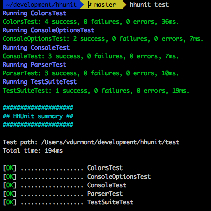

# HHUnit

Testing framework for Hack.

_**Disclaimer:** This is a "quick'n'dirty" project that I created while learning Hack and diving into PHP. It works pretty well for now but there are A LOT of things to do before using it in a real production environment :)_

## Installation

* Install [HHVM](http://docs.hhvm.com/manual/en/install-intro.install.php)
* Clone the repository
```
git clone git@github.com:vdurmont/HHUnit.git
```

_**TODO** Look into a .phar distribution_  
_**TODO** Make it available on packagist_

## Command line usage

You should create a cool alias to simplify your life:
```
alias hhunit="hhvm <HHUNIT_HOME>/HHUnit.hh"
```

Run the tests with:

```bash
hhvm <HHUNIT_HOME>/HHUnit.hh <TEST_PATH>
# Or with the alias:
hhunit <TEST_PATH>
```

Output example:



## Writing tests

### My first test

Let's say that this is the class you want to test (`<PROJECT>/src/MyCalculator.hh`):
```php
<?hh

class MyCalculator {
  public function add(int $a, int $b) : int {
    return $a + $b;
  }
}
```

Here is an example of test (`<PROJECT>/test/MyCalculatorTest.hh`):
```php
<?hh

require_once("<HHUNIT_HOME>/src/autoload.hh");
require_once("../src/MyCalculator.hh");

use \HHUnit\Test;

class MyCoolClassTest extends Test {
  public function test_add_two_positive_numbers() : void {
    // GIVEN
    $calculator = new MyCalculator();

    // WHEN
    $result = $calculator->add(3, 4);

    // THEN
    $this->assertEquals(7, $result);
  }
}
```

_**TODO** More examples_


## Lifecycle methods

There are 4 methods that you can override to set up or tear down a context for your tests.

* `Test::setUpClass` static method called before running the tests of this class
* `Test::setUp` called before each test method
* `Test::tearDown` called after each test method
* `Test::tearDownClass` static method called after running all the tests of this class

## Assertions

You can use a few builtin methods to make assertions in your code.

* `Test::assertEquals($expected, $actual, $message = null)`
* `Test::assertTrue($actual, $message = null)`
* `Test::assertFalse($actual, $message = null)`
* `Test::assertNull($actual, $message = null)`
* `Test::assertNotNull($actual, $message = null)`

If the assertion fails, an `\HHUnit\AssertionException` will be thrown.

_**TODO** We need more assert methods!_

## Mocking

_**TODO** Yeah do that._

## Contributing

Definitely! Send your pull requests or open new issues :)
