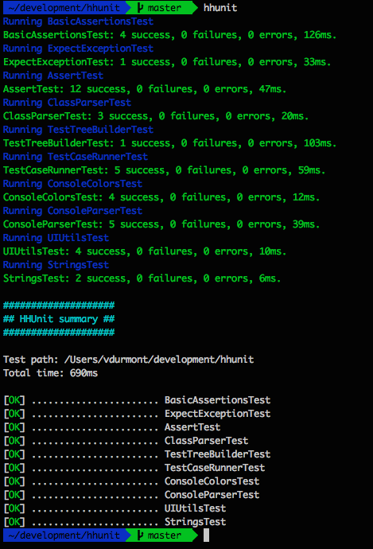

# HHUnit

Testing framework for Hack.



_**Disclaimer:** This is a "quick'n'dirty" project that I created while learning Hack and diving into PHP. There are A LOT of things to do before using it in a real production environment :)_

## Table of contents

* [Install and run](#Install-and-run)
* [My first test](#My-first-test)
* [More examples](#More-examples)
* [Testing lifecycle](#Testing-lifecycle)
* Extending HHUnit
* Contributing
* [License](#License)

## Install & run

// TODO

## My first test

Let's say you have a class like this one:

```php
<?hh // strict

class MyCalculator {
  public static function add(int $a, int $b) : int {
    return $a + $b;
  }
}
```

Here is a simple test (the name of the file and the class must end with `Test`):

```php
<?hh // strict

use \HHUnit\Assert\Assert;
use \HHUnit\Runner\ClassLoader;

class MyCalculatorTest {
  <<SetUpClass>>
  public static function setUpClass() : void {
    ClassLoader::loadClass(__DIR__."/MyCalculator.hh");
  }

  <<Test>>
  public function add_with_2_positive_integers() : void {
    $result = MyCalculator::add(3, 4);
    Assert::equals(7, $result);
  }
}
```

Let's run it:

```bash
hhunit /path/to/MyCalculatorTest.hh
```

## More examples

You can find examples in the [examples](./examples) folder.  

## Testing lifecycle

Here is how HHUnit works:

* **(1)** HHUnit will search recursively in the `testPath` directory for files named `HHUnitSetUp.hh`. If some are found, they will be executed.
* **(2)** For each TestSuite:
  * **(2.1)** If your TestSuite has a method with a `<<SetUpClass>>` attribute, it will be executed.
  * **(2.2)** For each TestCase:
    * **(2.2.1)** If your TestSuite has a method with a `<<SetUp>>` attribute, it will be executed.
    * **(2.2.2)** The TestCase method (with a `<<Test>>` attribute) will be executed.
    * **(2.2.3)** If your TestSuite has a method with a `<<TearDown>>` attribute, it will be executed.
  * **(2.3)** If your TestSuite has a method with a `<<TearDownClass>>` attribute, it will be executed.
* **(3)** HHUnit will search recursively in the `testPath` directory for files named `HHUnitTearDown.hh`. If some are found, they will be executed.

### Step 1: HHUnitSetUp

If the file exists, it will be executed before all the tests. Here are a few examples of what you could do there:

* Change the internal configuration of HHUnit (Runners, IFileService...)
* Start your database server
* Create a directory to store temporary files
* Register your `spl_autoload`
* // TODO other ideas?

### Step 2.1: SetUpClass

If you defined this method, it will be executed before running the TestSuite. Here are a few examples of what you could do there:

* Create a new database
* Check if the database state is clean
* Load the classes you need for this TestSuite
* // TODO other ideas?

### Step 2.2.1: SetUp

If you defined this method, it will be executed before running each TestCase. Here are a few examples of what you could do there:

* Check if the database state is clean
* Instantiate some common objects you use in the tests
* // TODO other ideas?

### Step 2.2.2: Test

Just write your test :)

### Step 2.2.3: TearDown

If you defined this method, it will be executed after running each TestCase. Here are a few examples of what you could do there:

* Clean the database
* Reset some common objects you use in the tests
* // TODO other ideas?

### Step 2.3: TearDownClass

If you defined this method, it will be executed after running the TestSuite. Here are a few examples of what you could do there:

* Delete a database
* Unload classes
* // TODO other ideas?

### Step 3: HHUnitTearDown

If the file exists, it will be executed after all the tests. Here are a few examples of what you could do there:

* Stop your database server
* Clean some temporary directories
* // TODO other ideas?

### A full example

If you have the following hierarchy:

```
<testPath>
      |- HHUnitSetUp.hh
      |- HHUnitTearDown.hh
      |- MyFirstTest.hh
      |- MySecondTest.hh
      |- folder1
      |    |- HHUnitSetUp.hh
      |    |- HHUnitTearDown.hh
      |    |- MyFirstSubTest.hh
      |    \- MySecondSubTest.hh
      |
      \- folder2
            \- MyThirdSubTest.hh
```

The execution flow will be:

```
<testPath>/HHUnitSetUp.hh
<testPath>/MyFirstTest.hh
<testPath>/MySecondTest.hh
<testPath>/folder1/HHUnitSetUp.hh
<testPath>/folder1/MyFirstSubTest.hh
<testPath>/folder1/MySecondSubTest.hh
<testPath>/folder1/HHUnitTearDown.hh
<testPath>/folder2/MyThirdSubTest.hh
<testPath>/HHUnitTearDown.hh
```

## Extending HHUnit

// TODO write me

## Contributing

// TODO write me

## License

Check out [LICENSE.md](./LICENSE.md).
